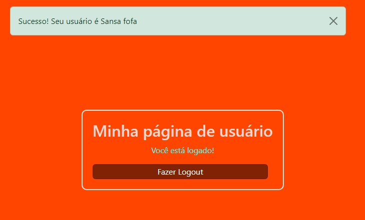

<h3> Explorando o Flask-login </h3>

Um dos recursos mais comuns de uma aplicação web é permitir que o usuário faça **login**. 
Com o pacote **flask_login** (uma extensão do Flask) é possível realizar validação, autenticação de usuário, gerenciamento de sessões, proteção de rotas entre outras funcionalidades.

**Objetivo:**
Nesse mini projeto trabalhamos:
- Os recursos 'Registro' e 'Login' de usuários;
- Estudamos sobre a extensão Flask-Login;
- (WTForms) Estudamos sobre bibliotecas Python para formulários e seus validadores de campo;
- (Flask-wtf) bibliotecas Flask para formulários;
- Validação;
- Autenticação;

O Flask-Login é uma extensão do flask que oferece gerenciamento de sessão de usuário, validação e proteção de rotas específicas. Vamos explorar alguns de seus componentes como:
- Flask-logout;
- login_manager;
- Login required decorator;
- current_user;
- UserMixin class;
- Flash messages;

      

